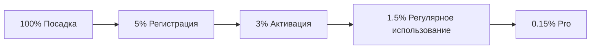

# TenderSearch — Customer Journey Map (CJM)

**Проект:** H025 TenderSearch — AI-анализ тендеров госзакупок  
**Дата:** 2026-06-22  
**Версия:** 1.0  

## Обзор

CJM описывает путь пользователя от первого знакомства с продуктом до регулярного использования и оплаты. 6 ключевых этапов с детализацией действий, эмоций, каналов и метрик.

---

## Этап 1: Посадка (Landing)

**Цель:** Привлечь потенциального поставщика на платформу.

| Параметр | Описание |
|---|---|
| **Действия** | Поиск в Google/Яндекс → Переход на лендинг → Изучение информации |
| **Точка входа** | Поисковая выдача (SEO), контекстная реклама, Telegram-канал, рекомендация коллеги |
| **Что видит** | Hero-блок с УТП, шаги работы, тарифы, FAQ |
| **Эмоции** | 🤔 Интерес, лёгкий скепсис |
| **Боли** | «Очередной сервис, который не сэкономит время?», «Сложно ли разобраться?» |
| **Решения** | Free-тариф без ограничений по времени, понятные 3 шага, живые примеры |
| **Метрики** | CTR на «Попробовать» > 10%, конверсия в регистрацию > 5%, отказы < 40% |
| **Каналы** | SEO (80% трафика), контекст (15%), Telegram (5%) |

---

## Этап 2: Онбординг (Onboarding)

**Цель:** Помочь пользователю создать первую подписку и понять ценность.

| Параметр | Описание |
|---|---|
| **Действия** | Регистрация → Попадание в ЛК → Создание первой подписки |
| **Точка входа** | Кнопка «Зарегистрироваться» на лендинге |
| **Что видит** | Пустой дашборд с подсказками, форма создания подписки |
| **Эмоции** | 😊 Любопытство, лёгкое замешательство |
| **Боли** | «Что писать в ключевых словах?», «Какие фильтры выбрать?» |
| **Решения** | Заполненные по умолчанию примеры, tooltip-подсказки, видео-туториал |
| **Метрики** | Time-to-first-subscription < 2 мин, активация > 60%, bounce rate в ЛК < 20% |
| **Триггеры** | Приветственный email с инструкцией, демо-подписка при регистрации |

---

## Этап 3: Aha-момент (Aha Moment)

**Цель:** Пользователь видит первую AI-подборку тендеров.

| Параметр | Описание |
|---|---|
| **Действия** | Открытие дашборда → Видны подобранные тендеры → Просмотр первой подборки |
| **Точка входа** | Email-уведомление «Подобрано N тендеров», возврат в ЛК |
| **Что видит** | Карточки подобранных тендеров с AI-оценкой релевантности |
| **Эмоции** | 🤩 «Вау, это работает!», удивление от точности подбора |
| **Боли** | «А точно ли эти тендеры мне подходят?» |
| **Решения** | AI-анализ каждой карточки с оценкой 1-10, детальный разбор рисков |
| **Метрики** | Time-to-aha < 5 мин после регистрации, возврат на дашборд > 50% на D1 |
| **Ключевой момент** | Пользователь понимает, что сервис реально экономит ему часы ручного поиска |

---

## Этап 4: Активация (Activation)

**Цель:** Пользователь активно использует продукт.

| Параметр | Описание |
|---|---|
| **Действия** | Открытие карточки тендера → Изучение AI-анализа → Переход по нескольким тендерам |
| **Точка входа** | Дашборд, email-рассылка, Telegram-бот |
| **Что видит** | Детальную карточку тендера с AI-анализом, рисками, рекомендацией |
| **Эмоции** | 💪 Уверенность, желание подать заявку |
| **Боли** | «Хватит ли мне лимита?», «Как отследить дедлайны?» |
| **Решения** | Прогресс-бар лимита, календарь дедлайнов, избранное |
| **Метрики** | DAU/MAU > 30%, просмотров тендеров > 5/сессия, создание ≥ 2 подписок |
| **Триггеры** | Ежедневный дайджест, уведомление о новых совпадениях |

---

## Этап 5: Удержание (Retention)

**Цель:** Пользователь возвращается регулярно.

| Параметр | Описание |
|---|---|
| **Действия** | Еженедельный возврат → Обновление подписок → Просмотр новых тендеров |
| **Точка входа** | Email-дайджест (пн/чт), Telegram-уведомления, прямые заходы |
| **Что видит** | Обновлённый список тендеров, новые AI-анализы, статистику |
| **Эмоции** | 🔁 Привычка, удовлетворение от регулярной ценности |
| **Боли** | «Не хватает лимита Free», «Хочу больше подписок» |
| **Решения** | Баннер с апгрейдом, триал Pro на 7 дней, сравнение тарифов |
| **Метрики** | MAU Retention > 40%, W1 → W4 retention > 25%, отток < 10%/мес |
| **Удержание** | Регулярный контент (статьи про тендеры), уведомления о важных изменениях |

---

## Этап 6: Монетизация (Monetization)

**Цель:** Конвертировать активного пользователя в платящего.

| Параметр | Описание |
|---|---|
| **Действия** | Исчерпание лимита → Предложение апгрейда → Оплата |
| **Точка входа** | Баннер в ЛК, email «Лимит исчерпан», страница тарифов |
| **Что видит** | Сравнение тарифов, преимущества Pro, форму оплаты |
| **Эмоции** | 😤 Раздражение от ограничения → 💳 Готовность платить за ценность |
| **Боли** | «Стоит ли оно того?», «Сложно ли оплатить?» |
| **Решения** | Понятное сравнение, быстрая оплата картой, триал Pro 7 дней |
| **Метрики** | Free→Pro конверсия > 5%, LTV > $50, средний чек $16 (Pro) |
| **Монетизация** | Ежемесячная подписка, возможен годовой план со скидкой 20% |

---

## Сводка каналов CJM

| Этап | Основной канал | Вспомогательный |
|---|---|---|
| Посадка | SEO / поиск | Telegram, контекст |
| Онбординг | Личный кабинет | Email-триггеры |
| Aha-момент | Дашборд | Email |
| Активация | Дашборд + Email | Telegram |
| Удержание | Email-дайджест | Telegram-уведомления |
| Монетизация | Баннер в ЛК | Email |

---

## Ключевые метрики CJM

**Воронка:**
- 1000 посетителей лендинга
- 50 регистраций (5%)
- 30 активаций (60% от регистраций)
- 15 активных пользователей (MAU)
- 1.5 платящих (5% от активаций)
