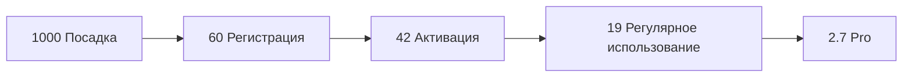

# TenderSearch — Customer Journey Map (CJM)

**Проект:** H025 TenderSearch — AI-аналитик тендеров госзакупок  
**Домен:** tenders.ivoryhome.ru  
**Дата:** 2026-06-23  
**Версия:** 2.0 (расширенная под детальный анализ документов)  

## Обзор

CJM описывает путь пользователя-поставщика от первого знакомства с платформой до регулярного получения готовых сводок по подходящим тендерам с разбором всей документации. 6 ключевых этапов с детализацией действий, эмоций, каналов и метрик.

**Главная ценность:** TenderSearch — это «умный аналитик закупок», который не просто ищет тендеры по ключевым словам, а **полностью разбирает содержимое каждого тендера**: скачивает все документы (Word, Excel, PDF, архивы), извлекает из них критерии оценки, требования к лицензиям/сертификатам (ФСТЭК, ФСБ, СРО и т.п.), финансовые условия (залог, банковская гарантия, обеспечение исполнения), сроки подачи и исполнения контракта. Поставщик получает готовую сводку с цветовой разметкой «совпало/не совпало» за 2 минуты вместо 2 часов ручного анализа.

**Источник данных:** zakupki.gov.ru (44-ФЗ + 223-ФЗ), FTP-выгрузки zakupki.gov.ru (XML по 44-ФЗ), публичные API партнёров (DaMIA, Multitender — резерв).

---

## Этап 1: Посадка (Landing)

**Цель:** Привлечь потенциального поставщика на платформу.

| Параметр | Описание |
|---|---|
| **Действия** | Поиск в Google/Яндекс → Переход на tenders.ivoryhome.ru → Изучение информации |
| **Точка входа** | Поисковая выдача (SEO: «как найти тендер», «анализ тендеров»), контекст, Telegram-каналы по госзакупкам, рекомендация коллеги |
| **Что видит** | Hero с УТП («AI-аналитик тендеров: разберёт все документы за 2 минуты»), демо-карточка с примером сводки, 3 тарифа, FAQ |
| **Эмоции** | 🤔 Заинтересованность, лёгкий скепсис («опять парсер, который не работает») |
| **Боли** | «Ручной разбор закупки — 2 часа», «Пропускаю дедлайны из-за объёма», «Критерии в Word-файлах невозможно найти» |
| **Решения** | Пример сводки в Hero, счётчик «проанализировано N тендеров», Free-тариф без ограничений по времени |
| **Метрики** | CTR на «Попробовать» > 12%, конверсия в регистрацию > 6%, отказы < 35% |
| **Каналы** | SEO (60%), Telegram-каналы по закупкам (25%), контекст (10%), сарафан (5%) |

---

## Этап 2: Онбординг (Onboarding)

**Цель:** Помочь пользователю создать первый профиль поставщика и подписку.

| Параметр | Описание |
|---|---|
| **Действия** | Регистрация → Заполнение профиля компании (ИНН, ОКВЭД, лицензии) → Создание первой подписки с ключевыми словами и фильтрами |
| **Точка входа** | Кнопка «Зарегистрироваться» на лендинге |
| **Что видит** | Wizard из 3 шагов: 1) ИНН (авто-подтягивание реквизитов из ЕГРЮЛ), 2) Категории закупок (ОКПД2), 3) Ключевые слова и фильтры |
| **Эмоции** | 😊 Любопытство → 🤨 Лёгкое замешательство на 2-м шаге («какие ключевые слова выбрать?») |
| **Боли** | «Что писать в ключевых словах?», «Какие фильтры важны для меня?», «Где взять список своих лицензий?» |
| **Решения** | Подсказки с примерами, авто-подтягивание данных компании по ИНН, готовые шаблоны фильтров (строительство, IT, медоборудование и т.п.), tooltip к каждому полю |
| **Метрики** | Time-to-first-subscription < 3 мин, активация > 70%, bounce на 2-м шаге < 25% |
| **Триггеры** | Приветственный email с примерами хорошо настроенных подписок, демо-подписка при регистрации |

**Важно:** Профиль поставщика хранит ключевые для матчинга данные:
- ИНН, ОГРН, КПП
- ОКВЭД2 / ОКПД2 (коды деятельности)
- **Лицензии и сертификаты:** ФСТЭК, ФСБ, СРО, МЧС, Ростехнадзор и др. (с номерами и сроком действия)
- Регионы присутствия
- Допустимый диапазон сумм контрактов
- Типы обеспечения (залог / банковская гарантия / страховка)

---

## Этап 3: Aha-момент (Aha Moment)

**Цель:** Пользователь видит первый AI-разбор тендера с полной сводкой.

| Параметр | Описание |
|---|---|
| **Действия** | Открытие дашборда → Видна первая AI-сводка тендера → Раскрытие детального разбора документов |
| **Точка входа** | Email-уведомление «Найден подходящий тендер», возврат в ЛК |
| **Что видит** | Карточку тендера со сводкой: ✅ Совпало (ОКПД2, регион, бюджет) / ⚠️ Требует проверки (лицензия) / ❌ Не совпало (срок подачи) / 📄 Извлечено из 3 документов |
| **Эмоции** | 🤩 «Вау, оно реально всё прочитало за меня!», удивление от точности |
| **Боли** | «А точно ли AI правильно понял Word-файл с кривой разметкой?», «Не пропустил ли что-то важное?» |
| **Решения** | Прямые цитаты из исходных документов в сводке, ссылка «Открыть оригинал файла», оценка уверенности AI (0-100%) для каждого пункта |
| **Метрики** | Time-to-aha < 5 мин после регистрации, раскрытие детальной сводки > 60%, переход в ЛК на D1 > 55% |
| **Ключевой момент** | Пользователь понимает, что сервис реально экономит ему 1.5-2 часа на каждом тендере |

**Что должна показать карточка-сводка:**

```
┌─────────────────────────────────────────────────────────────┐
│ 🟢 Тендер №0372200197324000123                              │
│ Поставка серверного оборудования                            │
│ Заказчик: Минцифры РФ                                       │
│ Начальная цена: 12 450 000 ₽                                │
│ Подача до: 28.06.2026 10:00                                 │
├─────────────────────────────────────────────────────────────┤
│ СОВПАЛО (✅)                                                │
│ • ОКПД2: 26.20.2 — ваш код деятельности                    │
│ • Регион поставки: Москва                                   │
│ • Бюджет: входит в ваш диапазон (до 50 млн)                │
│                                                             │
│ ТРЕБУЕТ ВНИМАНИЯ (⚠️)                                      │
│ • Нужна лицензия ФСТЭК на криптографию (у вас: до 2027)    │
│ • Срок подачи: 4 дня — успеете подготовить документы       │
│                                                             │
│ НЕ СОВПАЛО (❌)                                             │
│ • Требуется обеспечение заявки: 5% (622 500 ₽) — нет в      │
│   вашем профиле возможности залога                          │
├─────────────────────────────────────────────────────────────┤
│ 📄 Проанализировано документов: 3                           │
│   1. ТЗ (DOCX, 45 стр.) → критерии, сроки                 │
│   2. Проект контракта (DOCX) → финансы, сроки              │
│   3. Приложение (PDF) → требования к участникам            │
│                                                             │
│ 💰 Финансовые условия:                                      │
│   Обеспечение заявки: 622 500 ₽ (5%)                       │
│   Обеспечение контракта: 1 245 000 ₽ (10%)                 │
│   Срок исполнения: 90 календарных дней                     │
│                                                             │
│ 🏆 Критерии оценки (конкурс):                              │
│   1. Цена — 60%                                             │
│   2. Квалификация — 30%                                     │
│   3. Опыт — 10%                                             │
└─────────────────────────────────────────────────────────────┘
```

---

## Этап 4: Активация (Activation)

**Цель:** Пользователь активно использует платформу и доверяет AI-анализу.

| Параметр | Описание |
|---|---|
| **Действия** | Открытие нескольких карточек тендеров → Изучение AI-сводок → Принятие решения «подавать / не подавать» → Экспорт сводки в PDF/Excel |
| **Точка входа** | Дашборд, email-рассылка, Telegram-бот |
| **Что видит** | Список тендеров с быстрым verdict (✅ подходит / ⚠️ проверить / ❌ не подходит), фильтры по статусу, кнопка «Подробнее» |
| **Эмоции** | 💪 Уверенность, контроль над процессом, желание подавать |
| **Боли** | «Хватит ли мне лимита?», «Как отследить дедлайны?», «Можно ли доверять AI при суммах >10 млн?» |
| **Решения** | Прогресс-бар лимита, календарь дедлайнов, избранное, экспорт сводки для юриста/руководителя |
| **Метрики** | DAU/MAU > 35%, просмотров тендеров > 8/сессия, экспорт сводок > 3/мес, создание ≥ 2 подписок |
| **Триггеры** | Ежедневный дайджест в 9:00, push о новых совпадениях, Telegram-бот «Тендер дня» |

**Дополнительные фичи активации:**
- **Сравнение тендеров** — 2-3 карточки бок о бок
- **Календарь дедлайнов** — визуальный обзор ближайших 30 дней
- **Комментарии к сводке** — пометки «подаём», «отказ», «на проверку»
- **Совместный доступ** — ссылка на сводку для юриста/руководителя

---

## Этап 5: Удержание (Retention)

**Цель:** Пользователь возвращается регулярно и обновляет свои критерии.

| Параметр | Описание |
|---|---|
| **Действия** | Ежедневный возврат → Обновление профиля компании → Уточнение подписок → Просмотр новых тендеров |
| **Точка входа** | Email-дайджест (9:00 по будням), Telegram-уведомления о дедлайнах, прямые заходы |
| **Что видит** | Обновлённый список тендеров, новые AI-анализы, статистику «за месяц подано N заявок», предложения по улучшению профиля |
| **Эмоции** | 🔁 Привычка, удовлетворение от регулярной ценности, лёгкое беспокойство («не упускаю ли я что-то?») |
| **Боли** | «Не хватает лимита Free», «Хочу больше подписок», «Профиль устарел — лицензия закончилась» |
| **Решения** | Автоматические напоминания обновить профиль (за 30 дней до истечения лицензии), баннер с апгрейдом, триал Pro на 7 дней, сравнение тарифов |
| **Метрики** | MAU Retention > 45%, W1 → W4 retention > 30%, отток < 8%/мес, NPS > 40 |
| **Удержание** | Регулярный контент (статьи про изменения в 44-ФЗ), вебинары по работе с госзакупками, уведомления о важных изменениях в законодательстве |

**Ключевые механики удержания:**
- **Авто-обновление профиля:** каждые 30 дней проверка ЕГРЮЛ по ИНН, уведомление об изменениях
- **Трекинг лицензий:** напоминание за 60/30/7 дней до окончания срока действия
- **Персональные рекомендации:** «Вы получили N совпадений по подписке X, но не заходили 5 дней»
- **Дайджест недели:** топ-10 новых подходящих тендеров в одном письме

---

## Этап 6: Монетизация (Monetization)

**Цель:** Конвертировать активного пользователя в платящего.

| Параметр | Описание |
|---|---|
| **Действия** | Исчерпание лимита → Предложение апгрейда → Оплата → Доступ к расширенным функциям |
| **Точка входа** | Баннер в ЛК, email «Лимит исчерпан», страница тарифов, Telegram-бот |
| **Что видит** | Сравнение тарифов, преимущества Pro (больше AI-анализов документов, длинные файлы, приоритетная очередь), форму оплаты |
| **Эмоции** | 😤 Раздражение от ограничения → 💳 Готовность платить за ценность → 😊 Удовлетворение от Pro-функций |
| **Боли** | «Стоит ли оно того?», «Сложно ли оплатить?», «Что я получу за Pro?» |
| **Решения** | Понятное сравнение с примерами «Pro-юзер экономит 40 ч/мес», быстрая оплата картой / СБП, триал Pro 7 дней без ограничений |
| **Метрики** | Free→Pro конверсия > 7%, LTV > $80, средний чек $20 (Pro), Trial-to-Paid > 25% |
| **Монетизация** | Ежемесячная подписка + годовой план со скидкой 25% |

**Тарифная сетка (расширенная):**

| Тариф | Цена | AI-анализов/мес | Подписок | Документов на тендер | Приоритет |
|---|---|---|---|---|---|
| **Free** | 0 ₽ | 20 | 2 | до 5 | низкий |
| **Pro** | 1 990 ₽ | 200 | 10 | до 30 | стандартный |
| **Business** | 4 990 ₽ | 1 000 | 50 | без лимита | высокий |
| **Agency** | 9 990 ₽ | безлимитно | 100 | безлимитно | наивысший |

---

## Сводка каналов CJM

| Этап | Основной канал | Вспомогательный |
|---|---|---|
| Посадка | SEO / поиск | Telegram-каналы по закупкам, контекст |
| Онбординг | Личный кабинет | Email-триггеры |
| Aha-момент | Дашборд + Email | Telegram |
| Активация | Дашборд + Email | Telegram-бот |
| Удержание | Email-дайджест | Telegram-уведомления |
| Монетизация | Баннер в ЛК | Email |

---

## Ключевые метрики CJM



**Воронка:**
- 1000 посетителей лендинга
- 60 регистраций (6%)
- 42 активации (70% от регистраций — создали первую подписку)
- 19 активных пользователей (MAU)
- 2.7 платящих (14% от активаций — выше среднего за счёт ценности AI-разбора документов)

**Unit-экономика:**
- CAC: 250 ₽ (SEO + Telegram-каналы)
- ARPU Pro: 1 990 ₽/мес
- LTV (12 мес): ~17 000 ₽
- LTV/CAC > 60× → отличная экономика

---

## Уникальные сценарии использования

### Сценарий A: «Строительная компания ищет госконтракты»
1. Заполняет профиль: ИНН, СРО на строительство, ОКПД2 41-43
2. Создаёт подписку с ключевыми словами: «строительство», «ремонт», «капитальный», «благоустройство»
3. Каждое утро получает дайджест с 5-10 подходящими тендерами
4. AI выделяет: ✅ ОКПД2 совпал, ⚠️ нужно проверить обеспечение, ❌ регион не подходит
5. Экономит 2-3 часа в день на ручном просмотре

### Сценарий B: «IT-компания с лицензией ФСТЭК ищет госконтракты»
1. Указывает в профиле лицензию ФСТЭК с номером и сроком
2. Подписка: «серверы», «СХД», «IT-оборудование», «защита информации»
3. AI автоматически матчит закупки с требованием ФСТЭК
4. Видит точную цитату из ТЗ: «…наличие лицензии ФСТЭК на ТСКЗИ…»
5. Получает уведомление за 60 дней до истечения лицензии: «Обновите данные!»

### Сценарий C: «Агентство сопровождает 5 клиентов»
1. Тариф Agency: 100 подписок, безлимитный AI
2. Каждый клиент = отдельная подписка с профильными ключевыми словами
3. Экспорт сводок для юристов в PDF
4. Совместный доступ по ссылке
5. White-label отчёты (опционально, +2 990 ₽)

### Сценарий D: «Бухгалтер проверяет контракт на соответствие»
1. Вводит номер закупки вручную (без подписки)
2. AI скачивает все документы
3. Извлекает: сроки подачи, размер обеспечения, требования к победителю
4. Формирует PDF-отчёт «Сводка по контракту для бухгалтерии»

---

## Ключевые конкурентные преимущества (в сравнении с другими парсерами)

| Фича | TenderSearch | Конкуренты |
|---|---|---|
| Разбор документов Word/Excel/PDF/архивов | ✅ автоматически | ❌ только метаданные |
| Извлечение требований к лицензиям | ✅ с цитатой из ТЗ | ❌ |
| Сводка «совпало/не совпало» за 2 мин | ✅ | ❌ ручной просмотр |
| Цитаты из исходных документов в AI-ответе | ✅ | ❌ |
| Трекинг дедлайнов в календаре | ✅ | ⚠️ частично |
| Telegram-бот с уведомлениями | ✅ | ⚠️ только email |
| Цена за Pro | 1 990 ₽/мес | 5 000-15 000 ₽/мес |

---

## Что должен содержать профиль поставщика (ключевое)

Для точного матчинга AI должен знать:

**Юридические данные:**
- ИНН, ОГРН, КПП
- Форма собственности (ООО, ИП, АО)
- Дата регистрации
- Регион регистрации

**Деятельность:**
- ОКВЭД2 (основной + дополнительные)
- ОКПД2 (что можете поставлять)

**Лицензии и сертификаты** (с номерами и сроком действия):
- ФСТЭК (ТЗКИ, СКЗИ)
- ФСБ (криптография, гостайна)
- СРО (строительство, проектирование, изыскания)
- МЧС (пожарная безопасность)
- Ростехнадзор (опасные производственные объекты)
- Минпромторг (оборонка)
- Лицензии на фармдеятельность, меддеятельность, образование и др.

**Финансовые возможности:**
- Максимальный размер обеспечения заявки (₽)
- Максимальный размер обеспечения контракта (₽)
- Наличие банковской гарантии (да/нет/лимит)
- Минимальная и максимальная сумма контракта

**Логистика:**
- Регионы присутствия (склад, офис, доставка)
- Максимальное расстояние доставки

**Предпочтения по типам закупок:**
- 44-ФЗ / 223-ФЗ / оба
- Тип процедуры (аукцион, конкурс, запрос котировок, единственный поставщик)
- Заказчики (blacklist/whitelist)

---

## Чек-лист: что AI должен извлечь из документов тендера

### Из ТЗ (технического задания):
- [ ] Предмет закупки (кратко и подробно)
- [ ] Коды ОКПД2 / ОКВЭД2
- [ ] Объём поставки (кол-во, единицы)
- [ ] Требования к товару/работе/услуге (спецификации, ГОСТ, ТУ)
- [ ] Требования к участнику (лицензии, опыт, СРО)
- [ ] Условия поставки (место, сроки, INCOTERMS)
- [ ] Гарантийные обязательства
- [ ] Порядок приёмки

### Из проекта контракта:
- [ ] Срок действия контракта
- [ ] Срок исполнения обязательств
- [ ] Срок оплаты (аванс, постоплата, этапы)
- [ ] Размер обеспечения заявки (₽ и %)
- [ ] Размер обеспечения исполнения контракта (₽ и %)
- [ ] Размер обеспечения гарантийных обязательств
- [ ] Штрафы и пени
- [ ] Условия расторжения
- [ ] Порядок разрешения споров

### Из конкурсной документации (если конкурс):
- [ ] Критерии оценки (название, вес в %)
- [ ] Показатели по каждому критерию
- [ ] Порядок начисления баллов
- [ ] Порядок рассмотрения и оценки заявок
- [ ] Требования к содержанию заявки

### Из извещения:
- [ ] Номер закупки
- [ ] Заказчик (название, ИНН, контакты)
- [ ] Способ определения поставщика
- [ ] Дата и время окончания подачи заявок
- [ ] Дата и время вскрытия конвертов / проведения аукциона
- [ ] Начальная (максимальная) цена контракта
- [ ] Источник финансирования
- [ ] Преимущества (МСП, УИС и т.п.)
- [ ] Ограничения участия

---

## История изменений

| Версия | Дата | Автор | Изменения |
|---|---|---|---|
| 1.0 | 2026-06-22 | Проджект | Базовая структура CJM |
| 2.0 | 2026-06-23 | Проджект | Детализация: разбор документов, профиль поставщика, чек-лист извлечения данных, конкурентные преимущества |